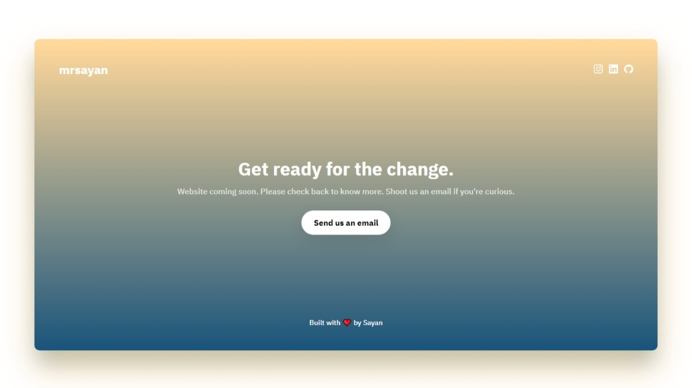

# Coming Soon Template 
___

___

### A minimal coming soon page, built using [create-react-app](https://github.com/facebook/create-react-app).

 

- A clean, professional landing page to announce your upcoming website launch. 

- With coming soon templates, you can keep your online presence intact or start the hype for something new early.

 

  

**Note:** Be mindful of many things that are considered "non-optimal".

## Getting started

### Installation

1. Clone this repository
2. `cd coming-soon` to go into the project root
3. `yarn` to install dependencies

### Running locally

1. `yarn start` to start the hot-reloading server
2. open `http://localhost:3000` on your browser

### Building

1. `yarn build` to build the app
2. Copy the contents of the `build` folder and serve it with your own server

## Thanks

Uses: 
 - [simple-icons](https://github.com/simple-icons/simple-icons) released under the [CC0-1.0](https://github.com/simple-icons/simple-icons/blob/develop/LICENSE.md) license.
 - [IBM Plex](https://github.com/IBM/plex) released under the [OFL-1.1](https://github.com/IBM/plex/blob/master/LICENSE.txt) license.
